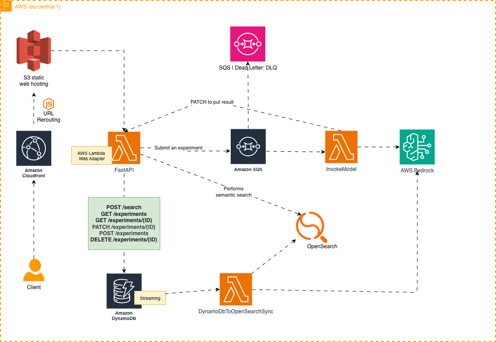

<div>
  <h1 align="center">🧪 LabJournal.ai</h1>
  <p align="center">
   <strong>Keep labs notebooks digital effortlessly!</strong>
   <br>
    An end-to-end serverless platform that digitizes handwritten notebooks using vision-text LLM and enables semantic search.
  </p>
</div>

<div align="center">
  
  
  
  
  
  
</div>


<p align="center">
  <a href="https://github.com/furkanmtorun/LabJournal.ai/actions/workflows/formatting_and_linting.yml">
    
  </a>
</p>


## 📺 Demo

  https://github.com/user-attachments/assets/a8e52c9c-b0d5-4f7a-b647-1238bc83a7fa

<br>

## 🏗️ Architecture


| Category | Technology | Engineering Implementation |
| :--- | :--- | :--- |
| **Infra as Code | Terraform | Modular HCL managing AWS Services and event-driven triggers. |
| **Compute** | AWS Lambda | High-performance ETL packaged via **Docker** for environment parity. |
| **Data Flow** | SQS + DLQ | Async. message queuing with Dead Letter Queues to prevent data loss. |
| **Intelligence** | AWS Bedrock | Generative AI for handwriting OCR and semantic embeddings. |
| **Persistence** | DynamoDB | Optimized NoSQL storage for experiment metadata. |
| **API Layer** | FastAPI | Python 3.12 backend with strict Pydantic type-hinting and validation. |
| **Interface** | JS / jQuery | Easy, lightweight front-end with Materialize CSS.
<br>

> **💡 Vibe Coding:** Used AI to handle CSS, UI, and testing boilerplate, freeing me up to focus on the core engineering.


<br>

## 🚀 Deployment & Usage

### **1. Provision Infrastructure**

- Install Terraform, AWS CLI and set the `.aws/credentials`.
- Provision Terraform | see [Terraform Deployment Readme](./terraform/deployment/README.md) for the details.
```bash
  export ENV="PROD" # "staging"
  terraform apply --var-file=$ENV.tfvars
```


### **2. Local API Development**
Ensure you have Python 3.10+ installed and AWS credentials configured.
```bash
# Setup environment
cd api/
python3.12 -m venv venv
source venv/bin/activate
pip install -r requirements.txt

# Launch with Uvicorn
uvicorn main:app --reload --port 8000
```

### **3. Frontend Access**
The frontend is made up by static web pages. Simply serve in any modern browser:
```bash
cd website && python3 -m http.server 8000
```

<br>

## 🎯 Future Enhancements

These are potential future improvements and are not guaranteed or part of the current roadmap.

- **Front-end**
  - Accessibility: Checks should be performed to ensure the application is usable by all potential users.
  - End-to-end (E2E) and Regression Tests: Cross browser, cross-platform and cross-device tests can be performed using [Playwright by Microsoft](https://playwright.dev/) or [Cypress](https://www.cypress.io/).
  - Performance: Metrics for performance, accessibility, SEO, and more can be generated using [Lighthouse by Google](https://developer.chrome.com/docs/lighthouse/overview).
  - Visual and Edge Case Tests:  Rendering a specific variation of a UI component can be performed using [Storybook](https://storybook.js.org/) and/or [Chromatic](https://www.chromatic.com/).
  - Stress and Load Tests: Both tests can be performed using [Locust](https://locust.io/).
- **Security** 
  - **IAM & Secrets**
    - Add stricter IAM guardrails, automatic security‑finding remediation, and better secrets management using [AWS Secrets Manager](https://aws.amazon.com/secrets-manager/).
  - **Authentication on API layer** There is currently no authentication layer for the API; it can be implemented in several ways or combined:
      - Directly inside FastAPI via [OAuth2](https://fastapi.tiangolo.com/tutorial/security/).
      - Integrating [AWS API Gateway Authorizer](https://docs.aws.amazon.com/apigateway/latest/developerguide/configure-api-gateway-lambda-authorization.html).
      - Implementing [JWT (JSON Web Token)](https://www.jwt.io/) for representing claims securely between two parties.
- **API**
  - [AWS API Gateway](https://docs.aws.amazon.com/apigateway/latest/developerguide/welcome.html#api-gateway-overview-features) can be configured in front of the Lambda‑hosted FastAPI to provide security controls (e.g., [AWS WAF](https://aws.amazon.com/waf/)), canary releases, logging, rate limiting, and metrics per endpoint.
- **Monitoring and Alerting**
  - Centralized Logging: CloudWatch can be used to aggregate logs from Lambda and other services.
  - Metrics: Key indicators for business, cost, security, and technical aspects should be collected and monitored in a centralized system.
  - Alerting: [Dependabot](https://github.com/dependabot) can scan for vulnerable dependencies and open pull requests to update them.
- **AWS**
  - Cost Analysis and Cost-Optimized Scaling: The current architecture is scalable, but it may be adjusted based on cost and alternative technologies or services.
  - Resilience: Multi‑Region support should be provided to the architecture and to reduce downtimes.
  - Security & Compliance: In many places, strict restrictions are not enforced; instead, the wildcard `"*"` is used for simplicity in IAM policies.
- **CI/CD**
  - All the tools and services related to security scans, tests, checks, and metrics above can be integrated into the CI pipeline before any release.
  - In this setup, deployment is performed locally but this should be done using CD after all CI checks pass.

<br>

## 👨🏻‍💻 Developer
- Furkan M. Torun | Data Engineer
- E-mail: [furkanmtorun[at]gmail[dot]com](mailto:furkanmtorun@gmail.com) 
- [Personal Website](https://furkanmtorun.github.io) | [LinkedIn](https://www.linkedin.com/in/furkanmtorun)
- [X/Twitter @furkanmtorun](https://www.x.com/furkanmtorun) | [Google Scholar Profile](https://scholar.google.com/citations?user=d5ZyOZ4AAAAJ) 

<br>

## 💬 Contribution

Please do not hesitate to reach out to me using links listed above or creating PR if you have any suggestions or feedback!
