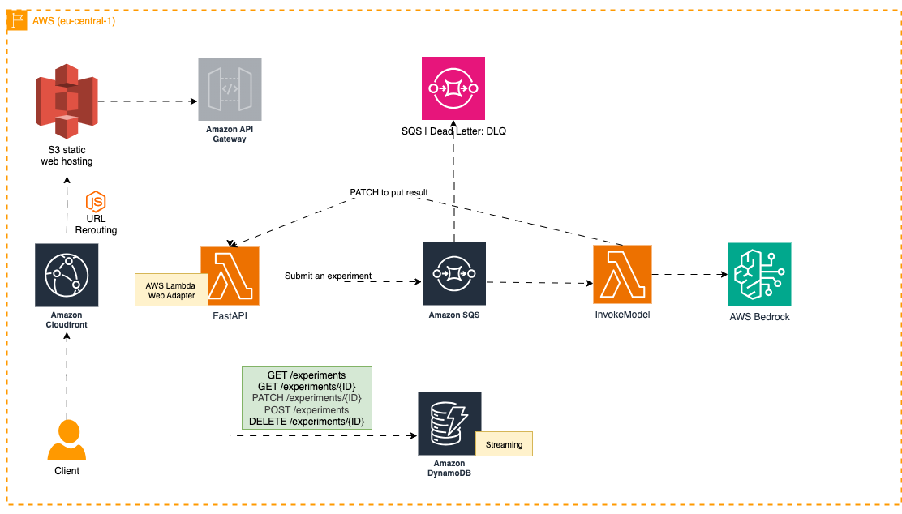

<style>
  h1, h2 { border-bottom: none; }
</style>

<div>
  <h1 align="center">LabJournal.ai</h1>
  <p align="center">
   <strong>Physical Research → Digital Intelligence.</strong>
   <br>
    An end-to-end Data Engineering ecosystem that digitizes handwritten lab notebooks using AWS Bedrock (LLM) and enables semantic search.
  </p>
</div>

<div align="center">
  
  
  
  
  
</div>

---


## 🏗️ System Architecture

| Category | Technology | Engineering Implementation |
| :--- | :--- | :--- |
| **Infra as Code** | **Terraform** | Modular HCL managing IAM roles, S3 buckets, and event-driven triggers. |
| **Compute** | **AWS Lambda** | High-performance ETL packaged via **Docker** for environment parity. |
| **Data Flow** | **SQS + DLQ** | Asynchronous message queuing with Dead Letter Queues to prevent data loss. |
| **Intelligence** | **AWS Bedrock** | Generative AI (`invoke_model`) for handwriting OCR and semantic embeddings. |
| **Persistence** | **DynamoDB** | Optimized NoSQL storage using Boto3 (`update_item`) for experiment metadata. |
| **API Layer** | **FastAPI** | Python 3.10+ backend with strict Pydantic type-hinting and validation. |
| **Interface** | **JS / jQuery** | Single-page application using **Materialize CSS** for real-time semantic query parsing. |

> **💡 Professional Workflow Note:** I utilized Github CoPilot as a force multiplier for non-critical boilerplate such as CSS layouts, UI/UX improvement, smoke tests, etc. to focus 90% of my development efforts on actual work itself.

---

## 🚀 Deployment & Usage

### **1. Provision Infrastructure**
Deploy the entire AWS stack (IAM, S3, Lambda, DynamoDB, SQS) with one command `terraform apply`:


- Install Terraform, AWS CLI and set the `.aws/credentials`.
- Appy Terraform
  ```bash
    export ENV="PROD" # "staging"
    terraform apply --var-file=$ENV.tfvars
  ```

- Follow [Terraform Deployment Readme](./terraform/deployment/README.md) to learn more details.


### **2. Local API Development**
Ensure you have Python 3.10+ installed and AWS credentials configured.
```bash
# Setup environment
cd api/
python3.12 -m venv venv
source venv/bin/activate
pip install -r requirements.txt

# Launch with Uvicorn
uvicorn main:app --reload --port 8000
```

### **3. Frontend Access**
The frontend is a static web pages. Simply serve the entry point `index.html` in any modern browser:
```bash
cd website && python3 -m http.server 8000
# go to http://localhost:8000
```

---

## 🛡️ CI/CD & Quality Assurance
[](https://github.com/furkanmtorun/LabJournal.ai/actions/workflows/formatting_and_linting.yml)
